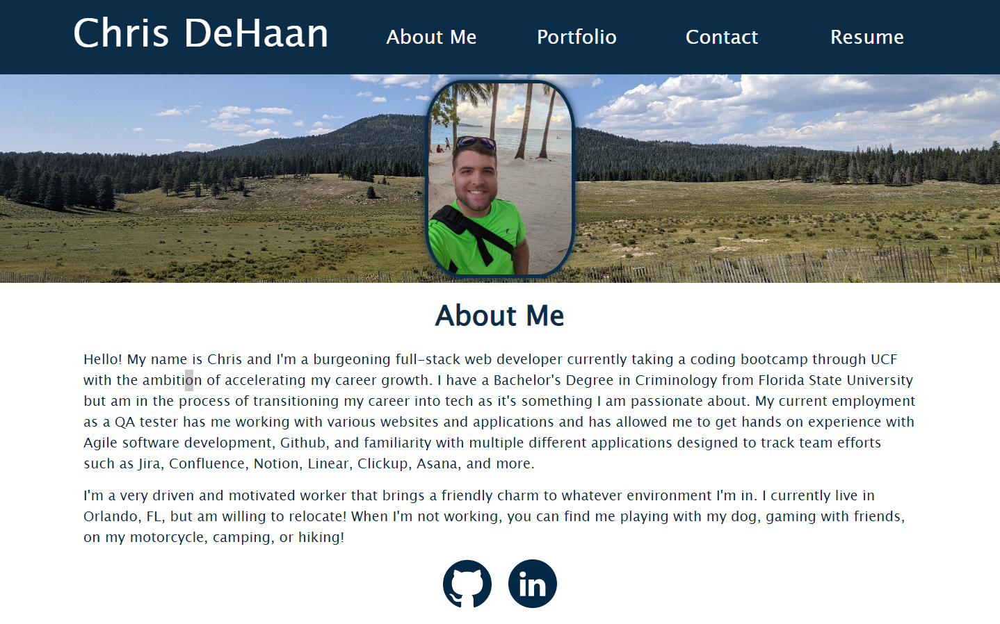

# REACT-Portfolio

  ## Description
  This is my portfolio written in REACT. I'm using it to showcase the projects I've worked on and my abilities as a full stack web engineer.

  

  ## Table of Contents
  - [Deployed-Link](#Deployed-Link) 
  - [License](#License)
  - [Questions](#Questions)

  ## Deployed-Link
  - https://christopher-dehaan-portfolio.netlify.app/

  ## License
  

  ## Questions
  - https://github.com/ChrisDeHaan
  - exampleaddress@example.com